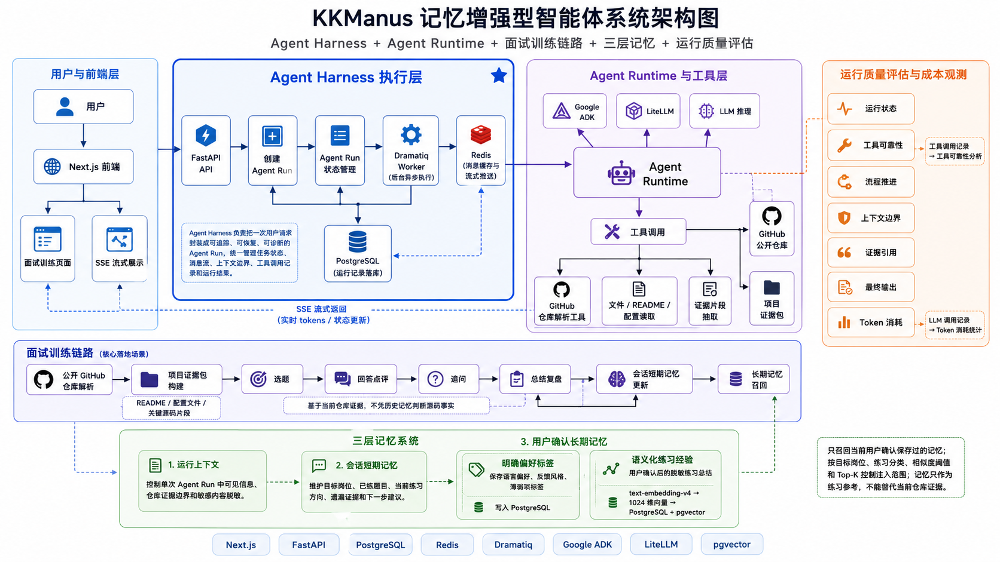

# KKManus 记忆增强型智能体系统

KKManus 是一个面向 AI Agent 应用开发场景的本地可部署智能体系统。项目参考 Suna 的通用 Agent 架构进行二次工程化改造，重点围绕 Agent Harness、Agent Runtime、工具调用、上下文边界、三层记忆和运行质量评估，补齐智能体系统从“能回答”到“可追踪、可诊断、可评估”的工程能力。

当前项目以 GitHub 项目面试训练作为核心落地场景：系统可以基于公开仓库内容构建项目证据包，生成贴合真实代码实现的面试题、答题方向、追问和复盘总结，并通过记忆系统支持多轮练习连续推进。

## 项目简介

大模型应用从普通问答走向 Agent 后，工程重点不再只是“最终回答是否正确”，还包括一次任务是否可追踪、工具调用是否可靠、上下文边界是否清晰、历史记忆是否可控，以及运行成本是否可观察。

KKManus 关注的正是这部分 Agent 工程能力：它将用户请求封装为独立的 Agent Run，并在外层通过 Agent Harness 管理任务生命周期、异步执行、流式返回、工具调用记录、记忆更新和运行质量评估。

因此，本项目的重点不是做一个单纯的聊天页面，而是搭建一套可用于真实 Agent 应用开发的执行底座，并用 GitHub 项目面试训练验证这套底座在证据构建、多轮练习、记忆召回和运行诊断中的实际效果。

## 项目背景与改造边界

本项目不是从零实现一个聊天机器人，也不是简单套壳模型 API，而是参考 Suna 的通用 Agent 架构进行接管式工程化改造。

改造重点包括：

- 将普通模型问答升级为可管理的 Agent Run。
- 接入 Agent Runtime，统一管理历史上下文、模型调用和工具函数。
- 构建面向 GitHub 项目的面试训练链路。
- 设计运行上下文、会话短期记忆、用户确认长期记忆组成的三层记忆体系。
- 建立 Agent 运行质量评估和 Token 成本观测机制。

## 核心能力概览

| 能力 | 解决的问题 |
| --- | --- |
| Agent Harness | 将一次用户请求抽象为可追踪、可诊断的智能体运行任务 |
| Agent Runtime | 统一承接历史上下文、模型推理和工具调用 |
| 面试训练链路 | 基于公开仓库证据生成题目、点评、追问和总结 |
| 三层记忆体系 | 管理单次任务边界、当前会话连续性和跨线程练习经验 |
| 运行质量评估 | 从运行状态、工具可靠性、上下文边界、证据引用和 Token 成本观察 Agent 表现 |

## 项目链路

项目链路分为两部分：

**智能体执行链路：**

用户输入 -> 创建 Agent Run -> 后台异步执行 -> Agent Runtime 推理与工具调用 -> Redis / SSE 流式返回 -> 数据落库 -> 运行评估与成本观测

**面试训练链路：**

公开仓库解析 -> 项目证据包构建 -> 选题 -> 回答点评 -> 追问 -> 总结复盘 -> 会话短期记忆更新 -> 长期记忆召回

## 核心设计

### Agent Harness 主链路

项目将一次用户请求从普通 HTTP 调用升级为独立的 Agent Run。Agent Run 不只代表“模型生成了一段回答”，而是代表一次完整的智能体任务：从用户输入、任务创建、后台执行、工具调用、流式返回，到最终落库和质量评估，都围绕同一个运行任务展开。

Harness 层主要承担 5 类工程职责：

- **任务生命周期管理**：后端先创建 Agent Run，记录运行状态、开始时间、完成时间和错误信息，使一次智能体任务可以被追踪、停止、恢复和诊断。
- **异步执行隔离**：长耗时流程交给 Dramatiq Worker 执行，接口层只负责创建任务和返回运行标识，避免普通请求被模型推理或工具调用长时间阻塞。
- **流式输出与断线补发**：Worker 将运行过程中的模型输出、工具状态和最终结果写入 Redis，前端通过 SSE 实时接收；如果前端断开连接，也可以从 Redis 中补发已产生的消息。
- **消息协议统一**：底层模型事件、工具调用事件和状态变化会被转换成前端可展示的文本消息、工具消息和状态消息，避免前端直接依赖 Runtime 内部事件结构。
- **失败收口与可诊断性**：工具失败、Workflow 异常或模型输出异常时，Harness 层会尽量返回结构化失败结果，而不是让前端卡在等待状态；后续运行评估也可以根据这些结构化信号定位问题。

这条主链路的核心价值是把 Agent 从“一次不可解释的模型调用”变成“一次有状态、有过程、有成本、有诊断入口的工程任务”。

### Agent Runtime 适配

项目接入 Google ADK 和 LiteLLM 作为 Agent Runtime，将历史上下文、模型调用和工具函数统一到智能体执行环境中。Runtime 负责真正驱动模型推理和工具调用，Harness 则负责把 Runtime 放进可追踪、可控制、可评估的工程链路里。

为了降低 Runtime 和产品层之间的耦合，项目在中间增加适配层：一方面从数据库事件中恢复模型上下文，另一方面将工具函数包装成 Runtime 可调用的函数工具；Runtime 返回事件后，再转换成前端能够展示和持久化的消息结构。

这样设计后，前端不需要直接理解底层模型事件，也不需要关心不同模型供应商的调用差异；后续如果更换模型、调整工具或升级 Runtime，也有相对清晰的适配边界。

### 面试训练工作流

当前核心落地场景是 GitHub 项目面试训练。系统根据公开仓库的 README、配置文件和关键源码片段，生成贴合项目实现的面试题、答题方向、追问和复盘总结。

面试训练流程拆成 4 个阶段：

1. 选题
2. 回答点评
3. 追问
4. 总结复盘

其中，确定性逻辑负责编排、选题和证据过滤，大模型只在允许的上下文中完成点评、追问和总结。这样的设计不是让模型自由决定所有步骤，而是把模型放在有边界的工作流里：每一阶段都有明确输入、可见证据和输出目标。

这条链路解决的是面试训练中的两个问题：一是避免题目和点评过于泛泛，二是避免模型脱离真实代码实现进行发挥。面试官追问时，也可以沿着“仓库证据包如何构建、证据如何进入题目、点评为什么可信、追问如何延续上下文”继续展开。

### 工具调用与证据边界

项目没有一次性恢复所有高权限工具，而是优先打通低风险、可解释的工具链路。GitHub 面试训练相关工具只基于公开仓库内容构建项目证据包，并通过证据引用和上下文边界约束模型输出。

在回答点评阶段，模型只能围绕当前题目允许的证据进行反馈；历史记忆、用户偏好和练习经验只能作为练习上下文，不能替代当前仓库证据，也不能凭历史记忆判断源码事实。

这也是项目里工具调用设计的基本原则：工具不是越多越好，而是要先明确权限、输入、输出和失败路径。对于文件、命令行、浏览器等高权限工具，只有在补齐权限控制、审计和沙箱边界后才适合逐步恢复。

## 数据与记忆设计

KKManus 将记忆系统按生命周期拆分为三层。

### 运行上下文

运行上下文服务于单次 Agent Run，用来控制当前任务中模型能看到什么、不能看到什么、允许引用哪些仓库证据，以及哪些敏感内容需要隐藏或脱敏。

它的重点不是长期保存用户信息，而是解释一次运行中的上下文边界，避免模型越界访问上下文，或者把历史记忆误当成当前仓库事实。

### 会话短期记忆

会话短期记忆以当前会话线程为范围，自动维护本轮面试训练的结构化状态，例如：

- 目标岗位
- 已练题目
- 当前练习方向
- 遗漏证据
- 下一步建议

它只保存结构化练习状态，不保存用户回答原文，用于保证多轮面试练习可以连续推进。

### 用户确认长期记忆

长期记忆必须经过用户确认后才会保存，并拆分为两类：

- **偏好标签**：保存语言偏好、反馈风格、薄弱项等明确标签。
- **练习经验**：保存脱敏后的练习总结，通过千问 `text-embedding-v4` 向量化后写入 PostgreSQL + pgvector，用于后续跨线程语义召回。

长期记忆召回时，只使用当前用户确认保存过的记忆，并按目标岗位、练习分类、相似度阈值和 Top-K 控制注入范围。召回结果只能作为练习参考，不能替代当前仓库证据；检索、向量化或数据库读取失败时自动降级，不阻塞 Agent 正常回答。

## Agent 运行质量评估

KKManus 增加了面向单次 Agent Run 的运行质量评估机制。它不是给用户回答打分，而是观察一次 Agent 任务本身是否健康。

当前评估重点包括 6 个维度：

- 运行状态
- 工具可靠性
- 流程推进
- 上下文边界
- 证据引用
- 最终输出质量

同时，系统会按运行任务统计每次回答的 Token 消耗，避免把同一会话中不同运行轮次的成本混在一起。这个机制可以帮助定位工具失败、上下文越界、证据不足、流程卡住和成本异常等问题。

## 技术栈

- 前端：Next.js / TypeScript
- 后端：FastAPI / Python
- 异步任务：Dramatiq / Redis
- Agent Runtime：Google ADK / LiteLLM
- 数据库：PostgreSQL / pgvector
- 记忆召回：千问 `text-embedding-v4` / pgvector
